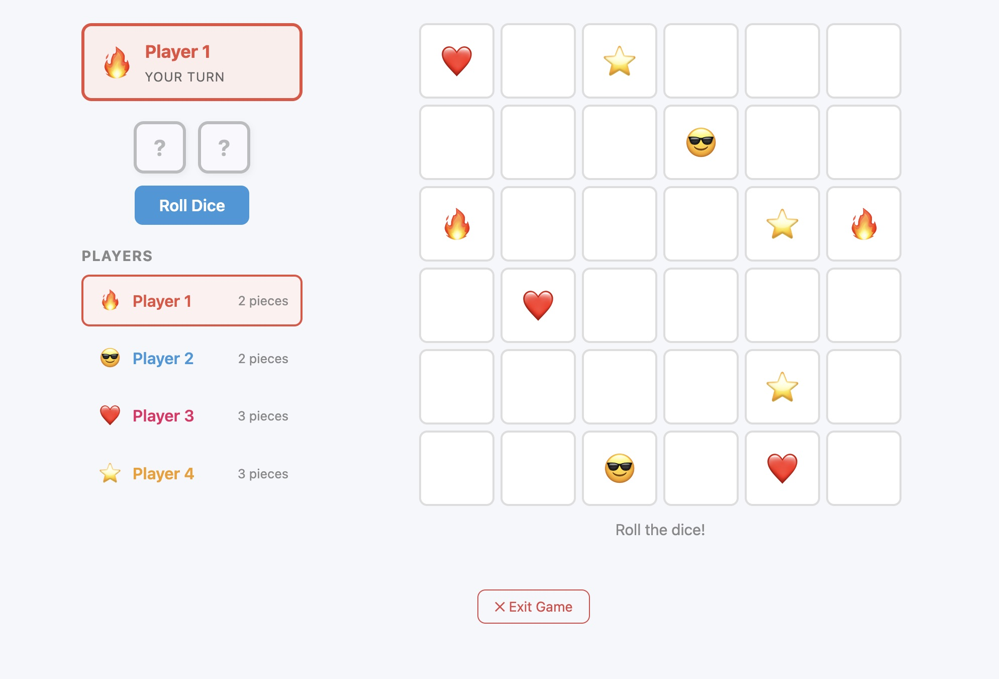

# Tic-Tac-Toe

A browser-based Tic-Tac-Toe game with extended rules, built with Vue 3 + Vite.



## Features

- Classic Tic-Tac-Toe gameplay
- Configurable board size and winning length
- Score tracking across games
- Rule variants and power-ups

## Getting Started

```bash
npm install
npm run dev
```

Open [http://localhost:5173](http://localhost:5173) in your browser.

## Scripts

| Command | Description |
|---------|-------------|
| `npm run dev` | Start development server |
| `npm run build` | Build for production |
| `npm run preview` | Preview production build |
| `npm run test:unit` | Run unit tests (Vitest) |
| `npm run test:e2e` | Run e2e tests (Playwright, headless) |
| `npm run test:e2e:ui` | Run e2e tests in interactive UI mode |
| `npm run test:e2e:report` | Open last e2e HTML report |
| `npm run lint` | Run ESLint |

## Testing

### Unit tests

Covers core game logic (win detection, move evaluation, game engine):

```bash
npm run test:unit
```

### E2E tests

Full browser tests covering the home page, setup flow, classic game loop, and advanced (card) mode. Playwright auto-starts the dev server if one isn't already running.

```bash
# One-time setup — install the Chromium browser binary
npx playwright install chromium

# Run all tests headlessly
npm run test:e2e

# Step through tests visually (great for debugging failures)
npm run test:e2e:ui

# Open the HTML report from the last headless run
npm run test:e2e:report
```

Run a single file or test:

```bash
npx playwright test e2e/tests/classic-game.spec.js --config=e2e/playwright.config.js
npx playwright test --config=e2e/playwright.config.js --headed   # show the browser
```

Test files live in `e2e/tests/`. Shared helpers are in `e2e/helpers/game-helpers.js`.

## Stack

- **Vue 3** (Composition API)
- **Vite**
- **Pinia** (state management)
- **Vitest** (unit testing)
- **Playwright** (e2e testing)